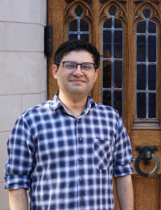
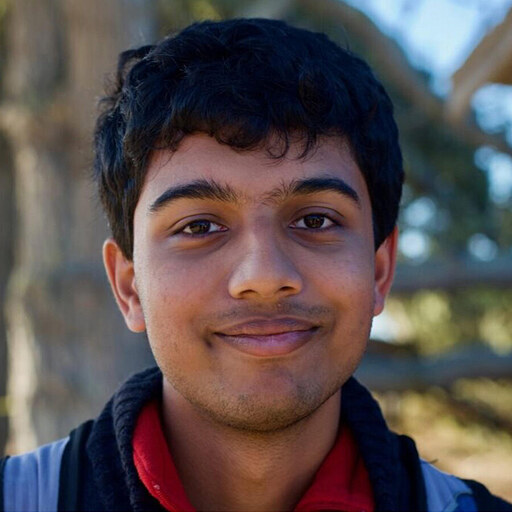
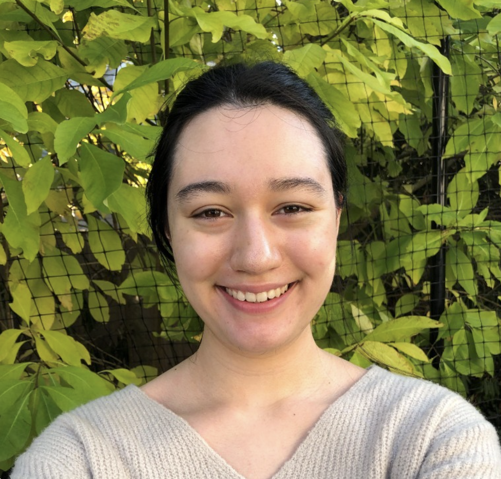
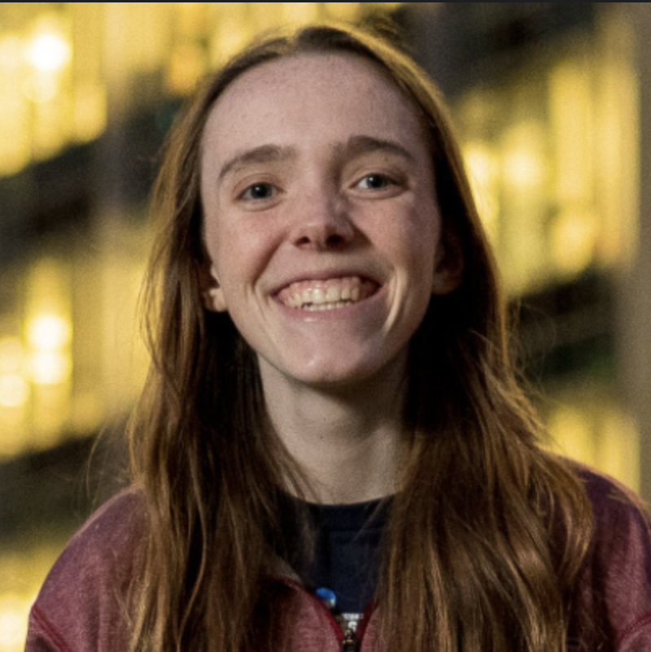
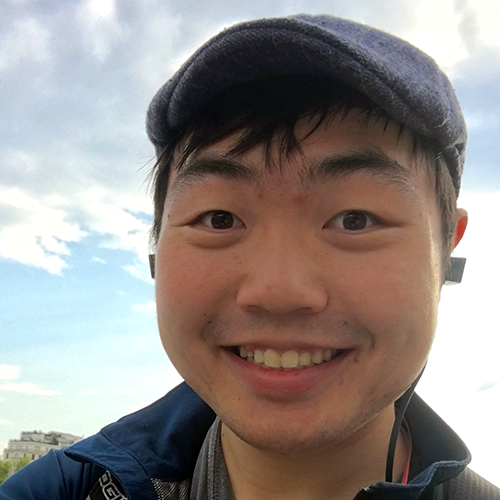

<link rel="stylesheet" href="../custom.css">

<!-- 

<b><h2 style="color: #09AD94">Images to Symbols Workshop: CogSci 2022</h2></b>

 -->

    
<h3>Building bridges between cognitive&nbsp;science&nbsp;🧠 and computer&nbsp;graphics&nbsp;🫖</h3>

We will be using a "flipped" workshop format:
<ul>
    <li><b>Before CogSci (Virtual)</b>. Join us for 4 virtual COGGRAPH seminars on Perception, Reasoning, Communication, and Expression.
    </li>
    <li><b>At <a href="https://cognitivesciencesociety.org/cogsci-2024/">CogSci 2024</a> in Rotterdam, NL</b>. Join us for a synthesis of the seminars and in-person activities.
    </li>
</ul>

    View the workshop proposal <a href="/assets/pdf/COGGRAPH_2024_proposal.pdf">here</a>.
    See the schedule of virtual seminars <a href="/schedule/">here</a>.

    Feel free to contact the organizers by emailing <a href="https://cs.stanford.edu/~kach/">Kartik</a>.
      

<h2>Schedule</h2>

<h3>visual perception seminar</h3>

Date: <b>TODO</b>.  Time: <b>TODO</b>

    

        <a href="http://cncl.yale.edu/" style="position:relative; display:block">Ilker Yildirim <strong>(Speaker)</strong></a>
        Yale University
        
    

   

      
      
 
      <a href="https://rgl.epfl.ch/people/wjakob" style="position:relative; display:block">Wenzel Jakob <strong>(Speaker)</strong></a>
      
 EPFL 

   

      

<h3>visual reasoning seminar</h3>

Date: TODO

 

Time: TODO

<h2>Organizers</h2>

    

        
        <a href="https://cs.stanford.edu/~kach/"><b>Kartik Chandra</b></a>
        
MIT

    

    

        
        <a href="https://persci.mit.edu/people/anne/"><b>Anne Harrington</b></a>
        
MIT

    

    

        
        <a href="https://spascience.github.io/"><b>Sean P. Anderson</b></a>
        
Stanford University

    

    

        
        <a href="https://collinskatie.github.io/"><b>Katherine Collins</b></a>
        
University of Cambridge

    

    

        
        <a
                href="https://redwood.berkeley.edu/people/chris-kymn/"><b>Christopher Kymn</b>
    </a>
        
UC Berkeley

    

    

        
        <a href="https://kushinm.github.io/"><b>Kushin Mukherjee</b></a>
        
UW Madison

    

    

        
        <a
                href="https://arnavverma.com/"><b>Arnav Verma</b></a>
        
Stanford University

    

    

        
        <a
                href="https://cogtoolslab.github.io/people.html"><b>Judith Fan</b></a>
        
Stanford University

    

   <svg 
   class="hourglass top"
   width="13.2cm"
   width="16cm"
   height="4.5999999cm"
   viewBox="0 0 132 45.999997"
   version="1.1"
   id="svg1"
   inkscape:version="1.3 (0e150ed, 2023-07-21)"
   sodipodi:docname="drawing.svg"

   xmlns:sodipodi="http://sodipodi.sourceforge.net/DTD/sodipodi-0.dtd"
   xmlns="http://www.w3.org/2000/svg"
   xmlns:svg="http://www.w3.org/2000/svg">
  <sodipodi:namedview
     id="namedview1"
     pagecolor="#ffD700"
     bordercolor="#666666"
     borderopacity="1.0"
    />
  <defs
     id="defs1" />
  <g
     inkscape:groupmode="layer"
     id="layer2"
     inkscape:label="Guide lines"
     style="display:none"
     sodipodi:insensitive="true">
    <path
       style="fill:none;stroke:#FFD700;stroke-width:0.264583px;stroke-linecap:butt;stroke-linejoin:miter;stroke-dasharray:0.264583, 3.175;stroke-dashoffset:0;stroke-opacity:1"
       d="m -8.1347222,30.795957 c 139.7410022,0 143.0435922,0 143.0435922,0"
       id="path12" />
    <path
       style="fill:none;stroke:#FFD700;stroke-width:0.264583px;stroke-linecap:butt;stroke-linejoin:miter;stroke-dasharray:0.264583, 1.5875;stroke-dashoffset:0;stroke-opacity:1"
       d="m -8.7539582,12.838107 c 139.7409982,0 143.0435882,0 143.0435882,0"
       id="path13" />
    <path
       style="fill:none;stroke:#FFD700;stroke-width:0.264583px;stroke-linecap:butt;stroke-linejoin:miter;stroke-dasharray:0.264583, 0.793749;stroke-dashoffset:0;stroke-opacity:1"
       d="m -8.1347222,38.846037 c 139.7410022,0 143.0435922,0 143.0435922,0"
       id="path14" />
    <path
       style="fill:none;stroke:#FFD700;stroke-width:0.264583px;stroke-linecap:butt;stroke-linejoin:miter;stroke-dasharray:0.264583, 0.793749;stroke-dashoffset:0;stroke-opacity:1"
       d="m -9.0134972,6.6828873 c 139.7410072,0 143.0435972,0 143.0435972,0"
       id="path5" />
  </g>
  <g
     inkscape:groupmode="layer"
     id="layer3"
     inkscape:label="Flourishes"
     style="display:inline">
    <circle
       style="display:none;fill:none;stroke:#FFD700;stroke-width:1;stroke-linecap:round;stroke-linejoin:round;stroke-dasharray:none;stroke-opacity:1"
       id="path2"
       cx="52.036522"
       cy="114.59793"
       r="1.4293199" />
    <path
       style="display:none;fill:none;stroke:#FFD700;stroke-width:1;stroke-linecap:round;stroke-linejoin:miter;stroke-dasharray:none;stroke-opacity:1"
       d="m 48.279362,122.19121 h 4.053934"
       id="path7"
       sodipodi:nodetypes="cc" />
    <path
       style="display:none;fill:none;stroke:#FFD700;stroke-width:1;stroke-linecap:round;stroke-linejoin:miter;stroke-dasharray:none;stroke-opacity:1"
       d="m 48.321761,126.35486 h 3.954467"
       id="path8"
       sodipodi:nodetypes="cc" />
    <circle
       style="display:none;fill:none;stroke:#FFD700;stroke-width:1;stroke-linecap:round;stroke-linejoin:round;stroke-dasharray:none;stroke-opacity:1"
       id="circle25"
       cx="147.34544"
       cy="137.68089"
       r="1.4293199" />
    <circle
       style="display:inline;fill:none;stroke:#FFD700;stroke-width:1;stroke-linecap:round;stroke-linejoin:round;stroke-dasharray:none;stroke-opacity:1"
       id="circle17"
       cx="80.631264"
       cy="-6.874115"
       r="1.4293199"
       transform="rotate(7.7128119)" />
    <circle
       style="display:inline;fill:none;stroke:#FFD700;stroke-width:1;stroke-linecap:round;stroke-linejoin:round;stroke-dasharray:none;stroke-opacity:1"
       id="circle18"
       cx="93.739754"
       cy="-23.779863"
       r="1.4293199"
       transform="rotate(16.592915)" />
    <path
       style="display:none;fill:none;stroke:#FFD700;stroke-width:1;stroke-linecap:round;stroke-linejoin:miter;stroke-dasharray:none;stroke-opacity:1"
       d="m 161.29784,133.85334 h 4.05394"
       id="path7-1"
       sodipodi:nodetypes="cc" />
    <path
       style="display:none;fill:none;stroke:#FFD700;stroke-width:1;stroke-linecap:round;stroke-linejoin:miter;stroke-dasharray:none;stroke-opacity:1"
       d="m 149.23496,135.01835 2.8758,-2.85732"
       id="path7-9"
       sodipodi:nodetypes="cc" />
    <path
       style="display:none;fill:none;stroke:#FFD700;stroke-width:1;stroke-linecap:round;stroke-linejoin:miter;stroke-dasharray:none;stroke-opacity:1"
       d="m 92.61672,135.22328 2.26072,-3.36506"
       id="path7-9-8"
       sodipodi:nodetypes="cc" />
    <path
       style="display:none;fill:none;stroke:#FFD700;stroke-width:1;stroke-linecap:round;stroke-linejoin:miter;stroke-dasharray:none;stroke-opacity:1"
       d="m 101.1502,132.0994 2.05027,3.49726"
       id="path26"
       sodipodi:nodetypes="cc" />
  </g>
  <g
     inkscape:label="Layer 1"
     inkscape:groupmode="layer"
     id="layer1">
    <path
       style="fill:none;stroke:#FFD700;stroke-width:1;stroke-linecap:round;stroke-linejoin:miter;stroke-dasharray:none;stroke-opacity:1"
       d="M 19.552635,10.647097 C 13.382817,3.8412073 3.3113248,9.6544073 2.8500188,18.954587 c -0.428801,8.64487 10.0370702,17.68366 17.3643902,8.40325"
       id="path1"
       sodipodi:nodetypes="csc" />
    <path
       style="fill:none;stroke:#FFD700;stroke-width:1;stroke-linecap:round;stroke-linejoin:round;stroke-dasharray:none;stroke-opacity:1"
       id="path9"
       sodipodi:type="arc"
       sodipodi:cx="47.090023"
       sodipodi:cy="21.685797"
       sodipodi:rx="8.8322525"
       sodipodi:ry="8.8322525"
       sodipodi:start="5.2166135"
       sodipodi:end="4.1814902"
       sodipodi:open="true"
       sodipodi:arc-type="arc"
       d="m 51.357137,13.952723 a 8.8322525,8.8322525 0 0 1 4.300432,9.879194 8.8322525,8.8322525 0 0 1 -8.449753,6.685347 8.8322525,8.8322525 0 0 1 -8.625052,-6.457605 8.8322525,8.8322525 0 0 1 4.035414,-9.990376" />
    <path
       style="fill:none;stroke:#FFD700;stroke-width:1;stroke-linecap:round;stroke-linejoin:round;stroke-dasharray:none;stroke-opacity:1"
       id="path10"
       sodipodi:type="arc"
       sodipodi:cx="-22.010687"
       sodipodi:cy="27.514992"
       sodipodi:rx="8.8322525"
       sodipodi:ry="8.8322525"
       sodipodi:start="4.9980465"
       sodipodi:end="4.4275996"
       sodipodi:open="true"
       sodipodi:arc-type="arc"
       d="m -19.521861,19.040652 a 8.8322525,8.8322525 0 0 1 6.253217,9.733452 8.8322525,8.8322525 0 0 1 -8.745877,7.573139 8.8322525,8.8322525 0 0 1 -8.739299,-7.580729 8.8322525,8.8322525 0 0 1 6.261665,-9.728019"
       transform="rotate(-90)" />
    <path
       style="fill:none;stroke:#FFD700;stroke-width:1;stroke-linecap:round;stroke-linejoin:round;stroke-dasharray:none;stroke-opacity:1"
       id="path11"
       sodipodi:type="arc"
       sodipodi:cx="67.42791"
       sodipodi:cy="-22.96549"
       sodipodi:rx="8.8322525"
       sodipodi:ry="8.8322525"
       sodipodi:start="5.6120587"
       sodipodi:end="4.1814902"
       sodipodi:open="true"
       sodipodi:arc-type="arc"
       d="m 74.344637,-28.457991 a 8.8322525,8.8322525 0 0 1 0.64955,10.04883 8.8322525,8.8322525 0 0 1 -9.185604,4.126209 8.8322525,8.8322525 0 0 1 -7.080694,-7.159936 8.8322525,8.8322525 0 0 1 4.228175,-9.139116"
       transform="scale(1,-1)" />
    <path
       style="fill:none;stroke:#FFD700;stroke-width:1;stroke-linecap:round;stroke-linejoin:miter;stroke-dasharray:none;stroke-opacity:1"
       d="m 55.930145,21.499577 v 9.93856 c 0,4.65668 -3.925007,8.00213 -9.506447,7.95085 -2.651711,-0.0244 -4.435419,-0.78977 -6.154157,-2.63361"
       id="path15"
       sodipodi:nodetypes="ccsc" />
    <circle
       style="fill:none;stroke:#FFD700;stroke-width:1;stroke-linecap:round;stroke-linejoin:round;stroke-dasharray:none;stroke-opacity:1"
       id="path2-9"
       cx="39.362141"
       cy="35.361404"
       r="1.4293199" />
    <path
       style="fill:none;stroke:#FFD700;stroke-width:1;stroke-linecap:round;stroke-linejoin:miter;stroke-dasharray:none;stroke-opacity:1"
       d="m 39.296713,25.926187 v 5.18909"
       id="path16" />
    <path
       style="fill:none;stroke:#FFD700;stroke-width:1;stroke-linecap:round;stroke-linejoin:miter;stroke-dasharray:none;stroke-opacity:1"
       d="m 39.328479,17.355817 c 0,-3.61876 -0.519639,-3.92003 -1.90872,-3.92003"
       id="path3"
       sodipodi:nodetypes="cc" />
    <path
       style="fill:none;stroke:#FFD700;stroke-width:1;stroke-linecap:round;stroke-linejoin:miter;stroke-dasharray:none;stroke-opacity:1"
       d="m 59.137966,19.956247 c 0.901595,-2.09217 1.259967,-6.37828 -1.748035,-6.5229 -1.137423,0 -2.274641,1.08712 -1.36781,2.79543"
       id="path4"
       sodipodi:nodetypes="csc" />
    <path
       style="fill:none;stroke:#FFD700;stroke-width:1;stroke-linecap:round;stroke-linejoin:miter;stroke-dasharray:none;stroke-opacity:1"
       d="m 20.416708,35.241307 c -4.791287,5.46769 -11.2062172,4.42398 -14.6294702,0.7282"
       id="path6"
       sodipodi:nodetypes="cc" />
    <path
       style="fill:none;stroke:#FFD700;stroke-width:1;stroke-linecap:round;stroke-linejoin:miter;stroke-dasharray:none;stroke-opacity:1"
       d="m 80.267563,7.4386773 -2.89046,21.3423697 c -0.16808,1.24104 0.34961,2.52553 2.36953,2.26723"
       id="path17"
       sodipodi:nodetypes="ccc" />
    <path
       style="fill:none;stroke:#FFD700;stroke-width:1;stroke-linecap:round;stroke-linejoin:miter;stroke-dasharray:none;stroke-opacity:1"
       d="m 95.979753,7.4827073 -3.15326,21.3051197 c -0.18336,1.23888 0.31839,2.52966 2.34142,2.29625"
       id="path18"
       sodipodi:nodetypes="ccc" />
    <path
       style="fill:none;stroke:#FFD700;stroke-width:1;stroke-linecap:round;stroke-linejoin:miter;stroke-dasharray:none;stroke-opacity:1"
       d="m 83.258033,7.3785973 1.15377,20.0538497 c 0.17467,3.58843 2.85818,3.99303 6.35828,2.72811"
       id="path19"
       sodipodi:nodetypes="ccc" />
    <path
       style="fill:none;stroke:#FFD700;stroke-width:1;stroke-linecap:round;stroke-linejoin:miter;stroke-dasharray:none;stroke-opacity:1"
       d="m 82.053123,17.921197 9.19844,-0.4255"
       id="path20"
       sodipodi:nodetypes="cc" />
    <path
       style="fill:none;stroke:#FFD700;stroke-width:1;stroke-linecap:round;stroke-linejoin:round;stroke-dasharray:none;stroke-opacity:1"
       id="path21"
       sodipodi:type="arc"
       sodipodi:cx="101.15454"
       sodipodi:cy="-22.006804"
       sodipodi:rx="8.8322525"
       sodipodi:ry="8.8322525"
       sodipodi:start="3.6764028"
       sodipodi:end="1.6235032"
       sodipodi:open="true"
       sodipodi:arc-type="arc"
       d="m 93.555576,-26.508406 a 8.8322525,8.8322525 0 0 1 10.826654,-3.719755 8.8322525,8.8322525 0 0 1 5.4042,10.091956 8.8322525,8.8322525 0 0 1 -9.09719,6.949389"
       transform="scale(1,-1)" />
    <path
       style="fill:none;stroke:#FFD700;stroke-width:1;stroke-linecap:round;stroke-linejoin:miter;stroke-dasharray:none;stroke-opacity:1"
       d="m 112.45154,19.782747 c 0.9016,-2.09217 1.25997,-6.37828 -1.74803,-6.5229 -1.13743,0 -2.27464,1.08712 -1.36781,2.79543"
       id="path23"
       sodipodi:nodetypes="csc" />
    <path
       style="fill:none;stroke:#FFD700;stroke-width:1;stroke-linecap:round;stroke-linejoin:round;stroke-dasharray:none;stroke-opacity:1"
       id="path24"
       sodipodi:type="arc"
       sodipodi:cx="120.74138"
       sodipodi:cy="-22.79199"
       sodipodi:rx="8.8322525"
       sodipodi:ry="8.8322525"
       sodipodi:start="6.2720196"
       sodipodi:end="4.1814902"
       sodipodi:open="true"
       sodipodi:arc-type="arc"
       d="m 129.57308,-22.890607 a 8.8322525,8.8322525 0 0 1 -7.21216,8.781115 8.8322525,8.8322525 0 0 1 -9.89289,-5.590521 8.8322525,8.8322525 0 0 1 3.8015,-10.708491"
       transform="scale(1,-1)" />
    <path
       style="fill:none;stroke:#FFD700;stroke-width:1;stroke-linecap:round;stroke-linejoin:miter;stroke-dasharray:none;stroke-opacity:1"
       d="m 129.57974,23.012547 c 0.11561,3.26725 0.0773,6.03702 -0.35561,8.17253 -2.36837,11.68288 -12.71772,8.61582 -14.59866,4.98951"
       id="path25"
       sodipodi:nodetypes="csc" />
    <path
       style="fill:none;stroke:#FFD700;stroke-width:1;stroke-linecap:round;stroke-linejoin:miter;stroke-dasharray:none;stroke-opacity:1"
       d="m 101.30053,13.166047 h 6.45346"
       id="path7-4"
       sodipodi:nodetypes="cc" />
    <path
       style="fill:none;stroke:#FFD700;stroke-width:1;stroke-linecap:round;stroke-linejoin:round;stroke-dasharray:none;stroke-opacity:1"
       id="path30"
       sodipodi:type="arc"
       sodipodi:cx="67.42791"
       sodipodi:cy="-22.96549"
       sodipodi:rx="8.8322525"
       sodipodi:ry="8.8322525"
       sodipodi:start="5.1959094"
       sodipodi:end="5.6640572"
       sodipodi:open="true"
       sodipodi:arc-type="arc"
       d="m 71.534014,-30.785247 a 8.8322525,8.8322525 0 0 1 3.086748,2.694177"
       transform="scale(1,-1)" />
  </g>
</svg>

<script src="{{ site.baseurl | prepend: site.url }}/typing.js">
