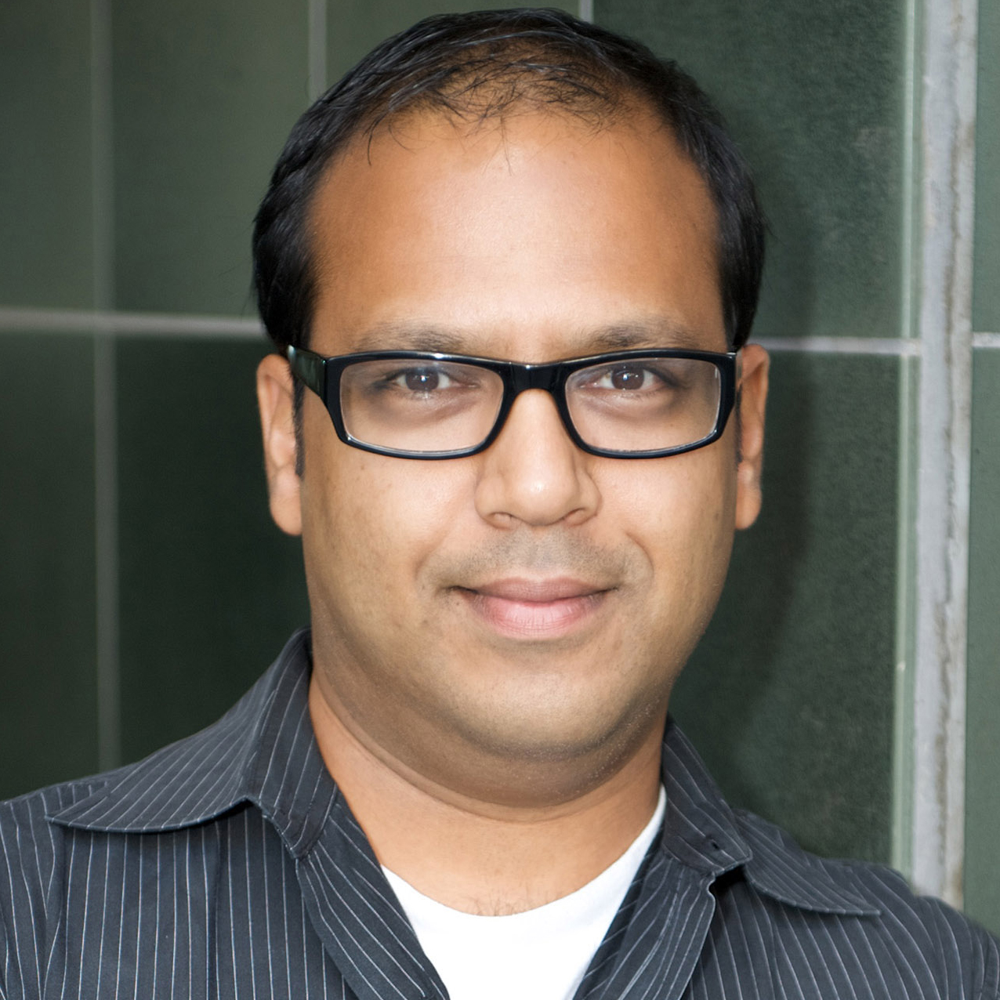
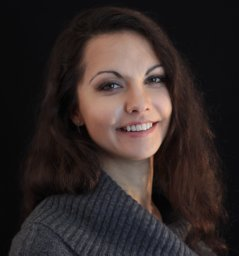
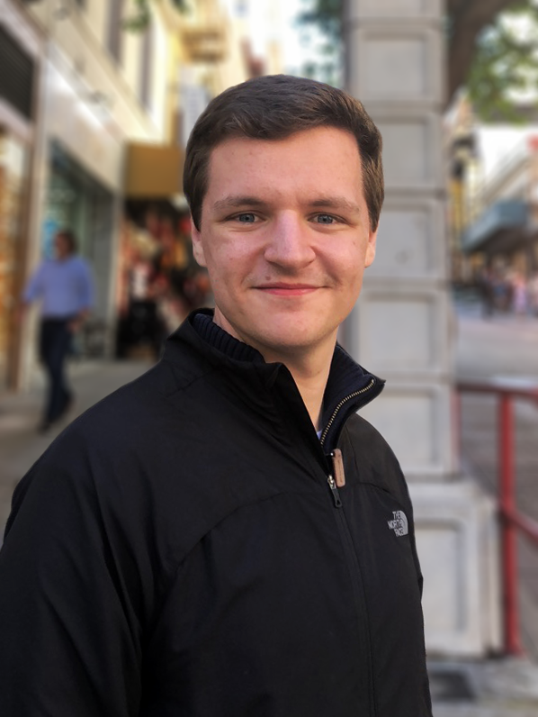
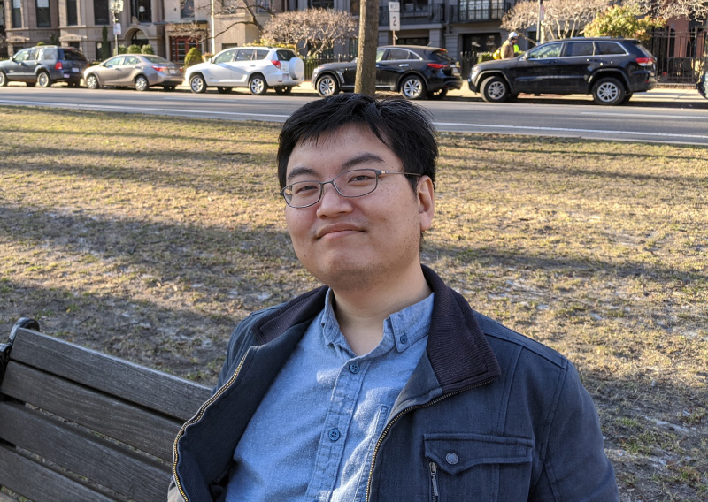
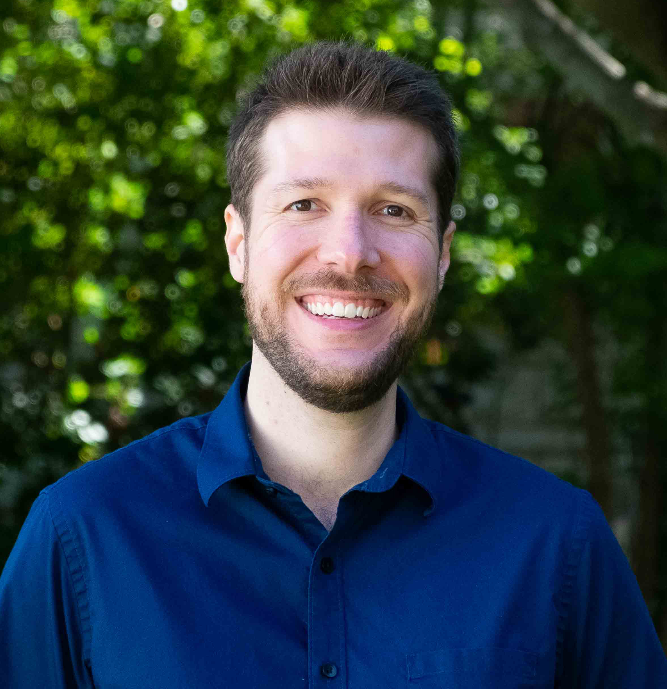
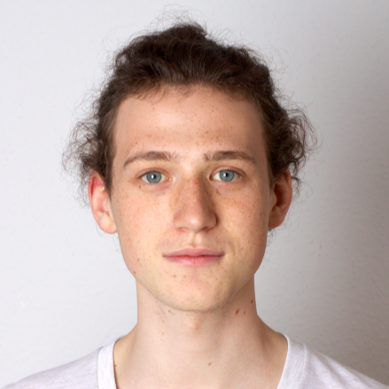
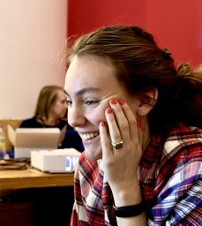
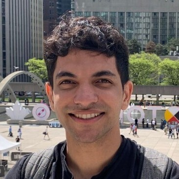

<link rel="stylesheet" href="../custom.css">

    
Image excerpted from Understanding Comics by Scott McCloud (1993)

<em class="quote">"Art being a thing of the mind, it follows that any scientific study of art will be psychology." </em> <em>&mdash;Max J Friedländer</em>

<em class="quote">"A work of art may be understood as a conductor from the artist's mind to the viewer's." </em>
<em>&mdash;Sol LeWitt</em>

<strong>COGGRAPH</strong> is a new workshop at the interface between <strong>cognitive science 🧠</strong> and <strong>computer graphics 🫖</strong>. Building bridges between these scientific communities can help us ask and answer big questions about perception and depiction: questions about how we <strong>see, communicate, reason, and express ourselves</strong>. We believe the study of the mind can help computer graphics advance the goals of visual computing, while the tools and methods of graphics can help us better study the mind &mdash; and we want to grow a community of researchers who feel the same. (For more on our vision for COGGRAPH, read our workshop proposal <a href="/assets/pdf/COGGRAPH_2024_proposal.pdf">here</a>.)

We're doing things a little differently than usual. In 2024, COGGRAPH will take place as a series of four <strong>virtual online seminars</strong> &mdash; free &amp; open to the public &mdash; featuring interactive conversations with experts from cognitive science, computer graphics, and the arts. Then, in late July, we will convene <strong>in-person</strong> for activities at the <a href="https://cognitivesciencesociety.org/cogsci-2024/">CogSci 2024</a> conference in Rotterdam. You can download the calendar events for all meetups <a href="/assets/ics/all_events.ics">here</a>! (In 2025, we'll plan to be at SIGGRAPH!)

Sign up for updates below! You are also welcome to contact the COGGRAPH organizers with questions and comments by emailing <a href="https://cs.stanford.edu/~kach/">Kartik</a>.

<iframe src="https://docs.google.com/forms/d/e/1FAIpQLSct1rOtqTtX1jDoO0tBlcO57P-8QxzFYFsseawvfZdZ7M_geQ/viewform?embedded=true" width="600" height="300" frameborder="0" marginheight="0" marginwidth="0">Loading…</iframe>

<h2 id="schedule">Schedule</h2>

<h3>Seminar #1: Visual Communication</h3>

    

        Date: <b>Wednesday, June 12th</b>. Time: <b>4:00pm ET</b>  
        <a href="https://uwmadison.zoom.us/meeting/register/tJIkce6hrjMpGdxVo7S13_YKmbL1woZLc8Hl">
            Register for Zoom Link
        </a>  
        <a href="/assets/ics/communication.ics" type="text/calendar">
            Download Calendar Event
        </a>
    

    
At its best, visual computing systems can empower people to communicate — with each other, and with their computer systems. But sometimes, visual computing technologies can lead to miscommunication, confusion, frustration, or worse. Why? What causes communication to break down, and what can we do about it?

    

        
        

            <a href="https://www.gabrielgreenberg.com/" style="position:relative; display:block">
                Gabriel Greenberg
            </a>
            
UCLA&nbsp;🧠

        

    

    

        
        

            <a href="https://graphics.stanford.edu/~maneesh/" style="position:relative; display:block">
                Maneesh Agrawala
            </a>
            
Stanford University&nbsp;🫖

        

    

    

        
        

            <a href="https://cyxiong.com/" style="position:relative; display:block">Cindy Xiong</a>
            
Georgia Tech&nbsp;🧠

        

    

    

        
        

            <a href="http://zoyathinks.com/" style="position:relative; display:block">Zoya Bylinskii</a>
            
Adobe&nbsp;🫖

        

    

<h3>Seminar #2: Visual Perception</h3>

    

        Date: <b>Monday, June 17th</b>. Time: <b>11:00am ET</b>  
        <a href="https://uwmadison.zoom.us/meeting/register/tJEtfuutrDgoG9E2DEAsv6iw42tk2zg5YCQC">
            Register for Zoom Link
        </a>  
        <a href="/assets/ics/perception.ics" type="text/calendar">
            Download Calendar Event
        </a>
    

    
The idea of modeling human perception as “inverse graphics” has long inspired researchers in cognitive science and AI — but despite decades of progress, such a model remains elusive. Why? What is the single greatest computational challenge in running optical or physical simulations in reverse?

    

        
        

            <a href="http://cncl.yale.edu/" style="position:relative; display:block">Ilker Yildirim
               </a>
            
Yale University&nbsp;🧠

        

    

    

        
        

            <a href="https://rgl.epfl.ch/people/wjakob" style="position:relative; display:block">Wenzel Jakob</a>
            
EPFL&nbsp;🫖

        

    

    

        

            <a href="https://www.mit.edu/~vpaulun/" style="position:relative; display:block">Vivian Paulun</a>
            
MIT&nbsp;🧠

        

    

    

        
        

            <a href="https://zferg.us/" style="position:relative; display:block">Zachary Ferguson
               </a>
            
MIT&nbsp;🫖

        

    

    

        
        

            <a href="https://cseweb.ucsd.edu/~tzli/" style="position:relative; display:block">Tzu-Mao Li</a>
            
UC San Diego&nbsp;🫖

        

    

<h3>Seminar #3: Visual Reasoning</h3>

    

        Date: <b>Wednesday, July 3rd</b>. Time: <b>4:00pm ET</b>  
        <a href="https://uwmadison.zoom.us/meeting/register/tJUlduigqzIjG9VdNNY0zJC9dGcZsQ6hlCms">
            Register for Zoom Link
        </a>  
        <a href="/assets/ics/reasoning.ics" type="text/calendar">
            Download Calendar Event
        </a>
    

    
From designing tools to proving theorems, people rely on spatial and geometric abstractions to solve problems. But of course, some abstractions are more helpful than others. Why? How can you tell if an abstraction will be useful for problem-solving?

    

        
        

            <a href="http://www.tomerullman.org/" style="position:relative; display:block">Tomer Ullman</a>
            
Harvard   University&nbsp;🧠

        

    

    

        
        

            <a href="https://dritchie.github.io/" style="position:relative; display:block">Daniel Ritchie</a>
            
Brown   University&nbsp;🫖

        

    

    

        
        

            <a href="https://k-r-allen.github.io/" style="position:relative; display:block">Kelsey Allen</a>
            
University of   British Columbia&nbsp;🧠

        

    

    

        
        

            <a href="http://www.gilbertbernstein.com/" style="position:relative; display:block">Gilbert Bernstein
               </a>
            
University of   Washington&nbsp;🫖

        

    

    

        
        

            <a href="https://ac.felixbinder.net/" style="position:relative; display:block">Felix Binder</a>
            
UC San Diego&nbsp;🧠

        

    

<h3>Seminar #4: Visual Expression</h3>

    

        Date: <b>Tuesday, July 16th</b>. Time: <b>2:00pm ET</b>  
        <a href="https://uwmadison.zoom.us/meeting/register/tJEkdOqhrzMuHNMYL166vM-y7VILNh15G3gG">
            Register for Zoom Link
        </a>  
        <a href="/assets/ics/expression.ics" type="text/calendar">
            Download Calendar Event
        </a>
    

    
The field of computer graphics has long been interested in algorithms for “non-photorealistic” rendering and animation. Why? What is it about the human mind that drives us to create — and allows us to perceive — images and videos that are not perceptually faithful to reality?

    

        
        

            <a href="https://www.dgp.toronto.edu/~hertzman/" style="position:relative; display:block">Aaron
                Hertzmann</a>
            
Adobe&nbsp;🫖

        

    

    

        
        

            <a href="https://www.cogconfluence.com/" style="position:relative; display:block">Sarah Schwettmann</a>
            
MIT&nbsp;🧠

        

    

    

        
        

            <a href="https://yael-vinker.github.io/website/" style="position:relative; display:block"> Yael
                Vinker</a>
            
Tel-Aviv University&nbsp;🫖

        

    

    

        
        

            <a href="https://otherthings.com/portfolio/" style="position:relative; display:block">Cassidy Curtis</a>
            
Google&nbsp;🫖

        

    

   
<h2 style="margin-bottom: 20px">Organizers</h2>

    

        
        <a href="https://cs.stanford.edu/~kach/"><b>Kartik Chandra</b></a>
        
MIT

    

    

        
        <a href="https://persci.mit.edu/people/anne/"><b>Anne Harrington</b></a>
        
MIT

    

    

        
        <a href="https://spascience.github.io/"><b>Sean P. Anderson</b></a>
        
Stanford University

    

    

        
        <a href="https://collinskatie.github.io/"><b>Katherine Collins</b></a>
        
University of Cambridge

    

    

        
        <a
                href="https://redwood.berkeley.edu/people/chris-kymn/"><b>Christopher Kymn</b>
    </a>
        
UC Berkeley

    

    

        
        <a href="https://kushinm.github.io/"><b>Kushin Mukherjee</b></a>
        
UW Madison

    

    

        
        <a
                href="https://arnavverma.com/"><b>Arnav Verma</b></a>
        
Stanford University

    

    

        
        <a
                href="https://cogtoolslab.github.io/people.html"><b>Judith Fan</b></a>
        
Stanford University

    

<!-- COGGRAPH graphic -->

    <svg
            class="hourglass top"
            width="13.2cm"
            width="16cm"
            height="4.5999999cm"
            viewBox="0 0 132 45.999997"
            version="1.1"
            id="svg1"
            inkscape:version="1.3 (0e150ed, 2023-07-21)"
            sodipodi:docname="drawing.svg"

            xmlns:sodipodi="http://sodipodi.sourceforge.net/DTD/sodipodi-0.dtd"
            xmlns="http://www.w3.org/2000/svg"
            xmlns:svg="http://www.w3.org/2000/svg">
        <sodipodi:namedview
                id="namedview1"
                pagecolor="#ffD700"
                bordercolor="#666666"
                borderopacity="1.0"
        />
        <defs
                id="defs1"/>
        <g
                inkscape:groupmode="layer"
                id="layer2"
                inkscape:label="Guide lines"
                style="display:none"
                sodipodi:insensitive="true">
            <path
                    style="fill:none;stroke:#FFD700;stroke-width:0.264583px;stroke-linecap:butt;stroke-linejoin:miter;stroke-dasharray:0.264583, 3.175;stroke-dashoffset:0;stroke-opacity:1"
                    d="m -8.1347222,30.795957 c 139.7410022,0 143.0435922,0 143.0435922,0"
                    id="path12"/>
            <path
                    style="fill:none;stroke:#FFD700;stroke-width:0.264583px;stroke-linecap:butt;stroke-linejoin:miter;stroke-dasharray:0.264583, 1.5875;stroke-dashoffset:0;stroke-opacity:1"
                    d="m -8.7539582,12.838107 c 139.7409982,0 143.0435882,0 143.0435882,0"
                    id="path13"/>
            <path
                    style="fill:none;stroke:#FFD700;stroke-width:0.264583px;stroke-linecap:butt;stroke-linejoin:miter;stroke-dasharray:0.264583, 0.793749;stroke-dashoffset:0;stroke-opacity:1"
                    d="m -8.1347222,38.846037 c 139.7410022,0 143.0435922,0 143.0435922,0"
                    id="path14"/>
            <path
                    style="fill:none;stroke:#FFD700;stroke-width:0.264583px;stroke-linecap:butt;stroke-linejoin:miter;stroke-dasharray:0.264583, 0.793749;stroke-dashoffset:0;stroke-opacity:1"
                    d="m -9.0134972,6.6828873 c 139.7410072,0 143.0435972,0 143.0435972,0"
                    id="path5"/>
        </g>
        <g
                inkscape:groupmode="layer"
                id="layer3"
                inkscape:label="Flourishes"
                style="display:inline">
            <circle
                    style="display:none;fill:none;stroke:#FFD700;stroke-width:1;stroke-linecap:round;stroke-linejoin:round;stroke-dasharray:none;stroke-opacity:1"
                    id="path2"
                    cx="52.036522"
                    cy="114.59793"
                    r="1.4293199"/>
            <path
                    style="display:none;fill:none;stroke:#FFD700;stroke-width:1;stroke-linecap:round;stroke-linejoin:miter;stroke-dasharray:none;stroke-opacity:1"
                    d="m 48.279362,122.19121 h 4.053934"
                    id="path7"
                    sodipodi:nodetypes="cc"/>
            <path
                    style="display:none;fill:none;stroke:#FFD700;stroke-width:1;stroke-linecap:round;stroke-linejoin:miter;stroke-dasharray:none;stroke-opacity:1"
                    d="m 48.321761,126.35486 h 3.954467"
                    id="path8"
                    sodipodi:nodetypes="cc"/>
            <circle
                    style="display:none;fill:none;stroke:#FFD700;stroke-width:1;stroke-linecap:round;stroke-linejoin:round;stroke-dasharray:none;stroke-opacity:1"
                    id="circle25"
                    cx="147.34544"
                    cy="137.68089"
                    r="1.4293199"/>
            <circle
                    style="display:inline;fill:none;stroke:#FFD700;stroke-width:1;stroke-linecap:round;stroke-linejoin:round;stroke-dasharray:none;stroke-opacity:1"
                    id="circle17"
                    cx="80.631264"
                    cy="-6.874115"
                    r="1.4293199"
                    transform="rotate(7.7128119)"/>
            <circle
                    style="display:inline;fill:none;stroke:#FFD700;stroke-width:1;stroke-linecap:round;stroke-linejoin:round;stroke-dasharray:none;stroke-opacity:1"
                    id="circle18"
                    cx="93.739754"
                    cy="-23.779863"
                    r="1.4293199"
                    transform="rotate(16.592915)"/>
            <path
                    style="display:none;fill:none;stroke:#FFD700;stroke-width:1;stroke-linecap:round;stroke-linejoin:miter;stroke-dasharray:none;stroke-opacity:1"
                    d="m 161.29784,133.85334 h 4.05394"
                    id="path7-1"
                    sodipodi:nodetypes="cc"/>
            <path
                    style="display:none;fill:none;stroke:#FFD700;stroke-width:1;stroke-linecap:round;stroke-linejoin:miter;stroke-dasharray:none;stroke-opacity:1"
                    d="m 149.23496,135.01835 2.8758,-2.85732"
                    id="path7-9"
                    sodipodi:nodetypes="cc"/>
            <path
                    style="display:none;fill:none;stroke:#FFD700;stroke-width:1;stroke-linecap:round;stroke-linejoin:miter;stroke-dasharray:none;stroke-opacity:1"
                    d="m 92.61672,135.22328 2.26072,-3.36506"
                    id="path7-9-8"
                    sodipodi:nodetypes="cc"/>
            <path
                    style="display:none;fill:none;stroke:#FFD700;stroke-width:1;stroke-linecap:round;stroke-linejoin:miter;stroke-dasharray:none;stroke-opacity:1"
                    d="m 101.1502,132.0994 2.05027,3.49726"
                    id="path26"
                    sodipodi:nodetypes="cc"/>
        </g>
        <g
                inkscape:label="Layer 1"
                inkscape:groupmode="layer"
                id="layer1">
            <path
                    style="fill:none;stroke:#FFD700;stroke-width:1;stroke-linecap:round;stroke-linejoin:miter;stroke-dasharray:none;stroke-opacity:1"
                    d="M 19.552635,10.647097 C 13.382817,3.8412073 3.3113248,9.6544073 2.8500188,18.954587 c -0.428801,8.64487 10.0370702,17.68366 17.3643902,8.40325"
                    id="path1"
                    sodipodi:nodetypes="csc"/>
            <path
                    style="fill:none;stroke:#FFD700;stroke-width:1;stroke-linecap:round;stroke-linejoin:round;stroke-dasharray:none;stroke-opacity:1"
                    id="path9"
                    sodipodi:type="arc"
                    sodipodi:cx="47.090023"
                    sodipodi:cy="21.685797"
                    sodipodi:rx="8.8322525"
                    sodipodi:ry="8.8322525"
                    sodipodi:start="5.2166135"
                    sodipodi:end="4.1814902"
                    sodipodi:open="true"
                    sodipodi:arc-type="arc"
                    d="m 51.357137,13.952723 a 8.8322525,8.8322525 0 0 1 4.300432,9.879194 8.8322525,8.8322525 0 0 1 -8.449753,6.685347 8.8322525,8.8322525 0 0 1 -8.625052,-6.457605 8.8322525,8.8322525 0 0 1 4.035414,-9.990376"/>
            <path
                    style="fill:none;stroke:#FFD700;stroke-width:1;stroke-linecap:round;stroke-linejoin:round;stroke-dasharray:none;stroke-opacity:1"
                    id="path10"
                    sodipodi:type="arc"
                    sodipodi:cx="-22.010687"
                    sodipodi:cy="27.514992"
                    sodipodi:rx="8.8322525"
                    sodipodi:ry="8.8322525"
                    sodipodi:start="4.9980465"
                    sodipodi:end="4.4275996"
                    sodipodi:open="true"
                    sodipodi:arc-type="arc"
                    d="m -19.521861,19.040652 a 8.8322525,8.8322525 0 0 1 6.253217,9.733452 8.8322525,8.8322525 0 0 1 -8.745877,7.573139 8.8322525,8.8322525 0 0 1 -8.739299,-7.580729 8.8322525,8.8322525 0 0 1 6.261665,-9.728019"
                    transform="rotate(-90)"/>
            <path
                    style="fill:none;stroke:#FFD700;stroke-width:1;stroke-linecap:round;stroke-linejoin:round;stroke-dasharray:none;stroke-opacity:1"
                    id="path11"
                    sodipodi:type="arc"
                    sodipodi:cx="67.42791"
                    sodipodi:cy="-22.96549"
                    sodipodi:rx="8.8322525"
                    sodipodi:ry="8.8322525"
                    sodipodi:start="5.6120587"
                    sodipodi:end="4.1814902"
                    sodipodi:open="true"
                    sodipodi:arc-type="arc"
                    d="m 74.344637,-28.457991 a 8.8322525,8.8322525 0 0 1 0.64955,10.04883 8.8322525,8.8322525 0 0 1 -9.185604,4.126209 8.8322525,8.8322525 0 0 1 -7.080694,-7.159936 8.8322525,8.8322525 0 0 1 4.228175,-9.139116"
                    transform="scale(1,-1)"/>
            <path
                    style="fill:none;stroke:#FFD700;stroke-width:1;stroke-linecap:round;stroke-linejoin:miter;stroke-dasharray:none;stroke-opacity:1"
                    d="m 55.930145,21.499577 v 9.93856 c 0,4.65668 -3.925007,8.00213 -9.506447,7.95085 -2.651711,-0.0244 -4.435419,-0.78977 -6.154157,-2.63361"
                    id="path15"
                    sodipodi:nodetypes="ccsc"/>
            <circle
                    style="fill:none;stroke:#FFD700;stroke-width:1;stroke-linecap:round;stroke-linejoin:round;stroke-dasharray:none;stroke-opacity:1"
                    id="path2-9"
                    cx="39.362141"
                    cy="35.361404"
                    r="1.4293199"/>
            <path
                    style="fill:none;stroke:#FFD700;stroke-width:1;stroke-linecap:round;stroke-linejoin:miter;stroke-dasharray:none;stroke-opacity:1"
                    d="m 39.296713,25.926187 v 5.18909"
                    id="path16"/>
            <path
                    style="fill:none;stroke:#FFD700;stroke-width:1;stroke-linecap:round;stroke-linejoin:miter;stroke-dasharray:none;stroke-opacity:1"
                    d="m 39.328479,17.355817 c 0,-3.61876 -0.519639,-3.92003 -1.90872,-3.92003"
                    id="path3"
                    sodipodi:nodetypes="cc"/>
            <path
                    style="fill:none;stroke:#FFD700;stroke-width:1;stroke-linecap:round;stroke-linejoin:miter;stroke-dasharray:none;stroke-opacity:1"
                    d="m 59.137966,19.956247 c 0.901595,-2.09217 1.259967,-6.37828 -1.748035,-6.5229 -1.137423,0 -2.274641,1.08712 -1.36781,2.79543"
                    id="path4"
                    sodipodi:nodetypes="csc"/>
            <path
                    style="fill:none;stroke:#FFD700;stroke-width:1;stroke-linecap:round;stroke-linejoin:miter;stroke-dasharray:none;stroke-opacity:1"
                    d="m 20.416708,35.241307 c -4.791287,5.46769 -11.2062172,4.42398 -14.6294702,0.7282"
                    id="path6"
                    sodipodi:nodetypes="cc"/>
            <path
                    style="fill:none;stroke:#FFD700;stroke-width:1;stroke-linecap:round;stroke-linejoin:miter;stroke-dasharray:none;stroke-opacity:1"
                    d="m 80.267563,7.4386773 -2.89046,21.3423697 c -0.16808,1.24104 0.34961,2.52553 2.36953,2.26723"
                    id="path17"
                    sodipodi:nodetypes="ccc"/>
            <path
                    style="fill:none;stroke:#FFD700;stroke-width:1;stroke-linecap:round;stroke-linejoin:miter;stroke-dasharray:none;stroke-opacity:1"
                    d="m 95.979753,7.4827073 -3.15326,21.3051197 c -0.18336,1.23888 0.31839,2.52966 2.34142,2.29625"
                    id="path18"
                    sodipodi:nodetypes="ccc"/>
            <path
                    style="fill:none;stroke:#FFD700;stroke-width:1;stroke-linecap:round;stroke-linejoin:miter;stroke-dasharray:none;stroke-opacity:1"
                    d="m 83.258033,7.3785973 1.15377,20.0538497 c 0.17467,3.58843 2.85818,3.99303 6.35828,2.72811"
                    id="path19"
                    sodipodi:nodetypes="ccc"/>
            <path
                    style="fill:none;stroke:#FFD700;stroke-width:1;stroke-linecap:round;stroke-linejoin:miter;stroke-dasharray:none;stroke-opacity:1"
                    d="m 82.053123,17.921197 9.19844,-0.4255"
                    id="path20"
                    sodipodi:nodetypes="cc"/>
            <path
                    style="fill:none;stroke:#FFD700;stroke-width:1;stroke-linecap:round;stroke-linejoin:round;stroke-dasharray:none;stroke-opacity:1"
                    id="path21"
                    sodipodi:type="arc"
                    sodipodi:cx="101.15454"
                    sodipodi:cy="-22.006804"
                    sodipodi:rx="8.8322525"
                    sodipodi:ry="8.8322525"
                    sodipodi:start="3.6764028"
                    sodipodi:end="1.6235032"
                    sodipodi:open="true"
                    sodipodi:arc-type="arc"
                    d="m 93.555576,-26.508406 a 8.8322525,8.8322525 0 0 1 10.826654,-3.719755 8.8322525,8.8322525 0 0 1 5.4042,10.091956 8.8322525,8.8322525 0 0 1 -9.09719,6.949389"
                    transform="scale(1,-1)"/>
            <path
                    style="fill:none;stroke:#FFD700;stroke-width:1;stroke-linecap:round;stroke-linejoin:miter;stroke-dasharray:none;stroke-opacity:1"
                    d="m 112.45154,19.782747 c 0.9016,-2.09217 1.25997,-6.37828 -1.74803,-6.5229 -1.13743,0 -2.27464,1.08712 -1.36781,2.79543"
                    id="path23"
                    sodipodi:nodetypes="csc"/>
            <path
                    style="fill:none;stroke:#FFD700;stroke-width:1;stroke-linecap:round;stroke-linejoin:round;stroke-dasharray:none;stroke-opacity:1"
                    id="path24"
                    sodipodi:type="arc"
                    sodipodi:cx="120.74138"
                    sodipodi:cy="-22.79199"
                    sodipodi:rx="8.8322525"
                    sodipodi:ry="8.8322525"
                    sodipodi:start="6.2720196"
                    sodipodi:end="4.1814902"
                    sodipodi:open="true"
                    sodipodi:arc-type="arc"
                    d="m 129.57308,-22.890607 a 8.8322525,8.8322525 0 0 1 -7.21216,8.781115 8.8322525,8.8322525 0 0 1 -9.89289,-5.590521 8.8322525,8.8322525 0 0 1 3.8015,-10.708491"
                    transform="scale(1,-1)"/>
            <path
                    style="fill:none;stroke:#FFD700;stroke-width:1;stroke-linecap:round;stroke-linejoin:miter;stroke-dasharray:none;stroke-opacity:1"
                    d="m 129.57974,23.012547 c 0.11561,3.26725 0.0773,6.03702 -0.35561,8.17253 -2.36837,11.68288 -12.71772,8.61582 -14.59866,4.98951"
                    id="path25"
                    sodipodi:nodetypes="csc"/>
            <path
                    style="fill:none;stroke:#FFD700;stroke-width:1;stroke-linecap:round;stroke-linejoin:miter;stroke-dasharray:none;stroke-opacity:1"
                    d="m 101.30053,13.166047 h 6.45346"
                    id="path7-4"
                    sodipodi:nodetypes="cc"/>
            <path
                    style="fill:none;stroke:#FFD700;stroke-width:1;stroke-linecap:round;stroke-linejoin:round;stroke-dasharray:none;stroke-opacity:1"
                    id="path30"
                    sodipodi:type="arc"
                    sodipodi:cx="67.42791"
                    sodipodi:cy="-22.96549"
                    sodipodi:rx="8.8322525"
                    sodipodi:ry="8.8322525"
                    sodipodi:start="5.1959094"
                    sodipodi:end="5.6640572"
                    sodipodi:open="true"
                    sodipodi:arc-type="arc"
                    d="m 71.534014,-30.785247 a 8.8322525,8.8322525 0 0 1 3.086748,2.694177"
                    transform="scale(1,-1)"/>
        </g>
    </svg>

<script src="{{ site.baseurl | prepend: site.url }}/typing.js">
