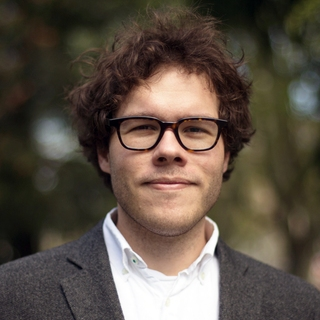
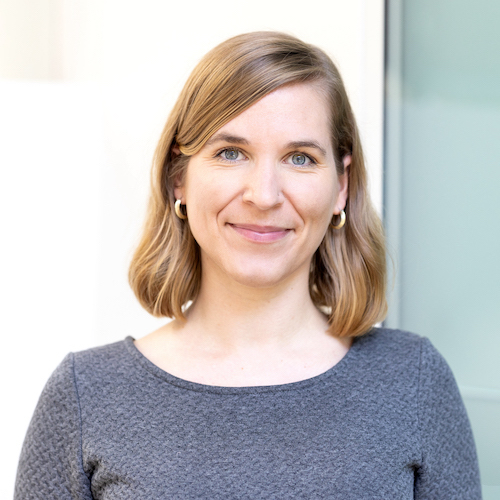

<link rel="stylesheet" href="{{ site.baseurl | prepend: site.url }}/custom.css">

    <!-- 

        <h1>Timeline</h1>
    
 -->

    

        

        

            

            

                

                    <h1>visual perception seminar</h1>
                     
                     
                    
Date: TODO

                    
Time: TODO PDT

                    <!-- 
<a href="TODO" style="position:relative; display:block">Link to recordings</a>
 -->
                

                

                    <h2>speakers</h2>
                    
                     
                    <a href="http://www.tomerullman.org/" style="position:relative; display:block">Tomer Ullman <strong>(Moderator)</strong></a>
                    Harvard University
                     
                    
                     
                    <a href="http://cncl.yale.edu/" style="position:relative; display:block">Ilker Yildirim <strong>(Speaker)</strong></a>
                    Yale University
                     
                    
                     
                    <a href="https://rgl.epfl.ch/people/wjakob" style="position:relative; display:block">Wenzel Jakob <strong>(Speaker)</strong></a>
                    EPFL
                     
                    
                     
                    <a href="https://www.mit.edu/~vpaulun/" style="position:relative; display:block">Vivian Paulun <strong>(Speaker)</strong></a>
                    MIT
                     
                    
                     
                    <a href="https://zferg.us/" style="position:relative; display:block">Zachary Ferguson <strong>(Speaker)</strong></a>
                    MIT
                     
                    
                     
                    <a href="https://cseweb.ucsd.edu/~tzli/" style="position:relative; display:block">Tzu-Mao Li <strong>(Speaker)</strong></a>
                    UC San Diego
                

            

        

        

            

            

                

                    <h1>visual reasoning seminar</h1>
                     
                     
                    
Date: TODO

                    
Time: TODO PDT

                    <!-- 
<a href="TODO" style="position:relative; display:block">Link to recordings</a>
 -->
                

                

                    <h2>speakers</h2>
                    
                     
                    <a href="https://dritchie.github.io/" style="position:relative; display:block">Daniel Ritchie <strong>(Speaker)</strong></a>
                    Brown University
                     
                    
                     
                    <a href="https://k-r-allen.github.io/" style="position:relative; display:block">Kelsey Allen <strong>(Speaker)</strong></a>
                    Google DeepMind
                     
                    
                     
                    <a href="http://www.gilbertbernstein.com/" style="position:relative; display:block">Gilbert Bernstein <strong>(Speaker)</strong></a>
                    University of Washington, Seattle
                     
                    
                     
                    <a href="https://ac.felixbinder.net/" style="position:relative; display:block">Felix Binder <strong>(Speaker)</strong></a>
                    UC San Diego
                

                 
                 
            

        

        

            

            

                

                    <h1>neuroscience seminar</h1>
                     
                     
                    
Date: Wednesday, July 13

                    
Time: 12PM-1:30PM PDT

                    

                        <a href="https://www.youtube.com/watch?v=UoBZp4hDY-U&list=PL2_Vc3j_d7HPHojt9q2pP8A3AM_pIGy7C&index=3"
                           style="position:relative; display:block">Link to recordings</a>

                

                

                    <h2>speakers</h2>

                    <a href="https://brainbridgelab.uchicago.edu/people/" style="position:relative; display:block">Wilma
                        Bainbridge<strong> (Chair)</strong></a>
                    University of Chicago
                    

                     

                    <a href="https://www.thelamplab.ca/lab-members" style="position:relative; display:block">Jeffrey
                        Wammes<strong> (Speaker)</strong></a>
                    Queen's University
                    

                     

                    <a href="http://www.mrc-cbu.cam.ac.uk/people/Matt.Lambon-Ralph/"
                       style="position:relative; display:block">Matt Lambon-Ralph<strong> (Speaker)</strong></a>
                    University of Cambridge
                    

                

            

        

        

            

            

                <h2> CogSci 2022</h2>
                
Date: July 27th, 08:30 – 16:30 EDT

                
Toronto, Canada

            

        

    

<script src="{{ site.baseurl | prepend: site.url }}/timeline.js">
