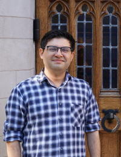

<link rel="stylesheet" href="../custom.css">

    <!-- 

        <h1>Timeline</h1>
    
 -->

    

        

        

            

            

                

                    <h1>visual perception seminar</h1>
                     
                     
                    
Date: TODO

                    
Time: TODO PDT

                    <!-- 
<a href="TODO" style="position:relative; display:block">Link to recordings</a>
 -->
                

                

                    <h2>speakers</h2>
                     

                    <a href="http://cncl.yale.edu/" style="position:relative; display:block">Ilker Yildirim <strong>(Speaker)</strong></a>
                    Yale University
                     
                    
                      
                    
                    <a href="https://rgl.epfl.ch/people/wjakob" style="position:relative; display:block">Wenzel Jakob <strong>(Speaker)</strong></a>
                    EPFL
                     
                    
                      
                    
                    <a href="https://www.mit.edu/~vpaulun/" style="position:relative; display:block">Vivian Paulun <strong>(Speaker)</strong></a>
                    MIT
                     
                    
                      
                    
                    <a href="https://zferg.us/" style="position:relative; display:block">Zachary Ferguson <strong>(Speaker)</strong></a>
                    MIT
                     
                    
                      
                    
                    <a href="https://cseweb.ucsd.edu/~tzli/" style="position:relative; display:block">Tzu-Mao Li <strong>(Speaker)</strong></a>
                    UC San Diego
                     
                    
                    
                

            

        

        

            

            

                

                    <h1>visual reasoning seminar</h1>
                     
                     
                    
Date: TODO

                    
Time: TODO PDT

                    <!-- 
<a href="TODO" style="position:relative; display:block">Link to recordings</a>
 -->
                

                

                    <h2>speakers</h2>
                     

                    <a href="http://www.tomerullman.org/" style="position:relative; display:block">Tomer Ullman <strong>(Moderator)</strong></a>
                    Harvard University
                    
                      

                    <a href="https://dritchie.github.io/" style="position:relative; display:block">Daniel Ritchie <strong>(Speaker)</strong></a>
                    Brown University
                     
                    
                      

                    <a href="https://k-r-allen.github.io/" style="position:relative; display:block">Kelsey Allen <strong>(Speaker)</strong></a>
                    Google DeepMind
                     
                    
                      

                    <a href="http://www.gilbertbernstein.com/" style="position:relative; display:block">Gilbert Bernstein <strong>(Speaker)</strong>
                    </a>
                    University of Washington, Seattle
                     
                    
                      

                    <a href="https://ac.felixbinder.net/" style="position:relative; display:block">Felix Binder <strong>(Speaker)</strong></a>
                    UC San Diego
                     
                    
                     
                    
                

                 
                 
            

        

        

            

            

                

                    <h1>visual communication seminar</h1>
                     
                     
                    
Date: TODO

                    
Time: TODO PDT

                    <!-- 

                        <a href="https://www.youtube.com/watch?v=UoBZp4hDY-U&list=PL2_Vc3j_d7HPHojt9q2pP8A3AM_pIGy7C&index=3"
                           style="position:relative; display:block">Link to recordings</a>
 -->

                

                

                    <h2>speakers</h2>
                     

                    <a href="https://www.gabrielgreenberg.com/" style="position:relative; display:block">
                    Gabriel Greenberg<strong> (Moderator)</strong></a>
                    UCLA
                     
                    
                      

                    <a href="https://graphics.stanford.edu/~maneesh/" style="position:relative; display:block">
                    Maneesh Agrawala<strong> (Speaker)</strong></a>
                    Stanford University
                     
                    
                      

                    <a href="https://cyxiong.com/"
                       style="position:relative; display:block"> Cindy Xiong<strong> (Speaker)</strong></a>
                    Georgia Tech
                     
                    
                      

                    <a href="http://zoyathinks.com/"
                       style="position:relative; display:block"> Zoya Bylinskii<strong> (Speaker)</strong></a>
                    Adobe
                     
                    
                     

                

            

        

          

            

            

                

                    <h1>visual expression seminar</h1>
                     
                     
                    
Date: TODO

                    
Time: TODO PDT

                    <!-- 

                        <a href="https://www.youtube.com/watch?v=UoBZp4hDY-U&list=PL2_Vc3j_d7HPHojt9q2pP8A3AM_pIGy7C&index=3"
                           style="position:relative; display:block">Link to recordings</a>
 -->

                

                

                    <h2>speakers</h2>
                     

                    <a href="https://www.dgp.toronto.edu/~hertzman/" style="position:relative; display:block">
                    Aaron Hertzmann<strong> (Speaker)</strong></a>
                    Adobe
                     
                    
                      

                    <a href="https://www.cogconfluence.com/" style="position:relative; display:block">
                    Sarah Schwettmann<strong> (Speaker)</strong></a>
                    MIT
                     
                    
                      

                    <a href="https://yael-vinker.github.io/website/"
                       style="position:relative; display:block"> Yael Vinker<strong> (Speaker)</strong></a>
                    Tel-Aviv University
                     
                    
                      

                    <a href="https://otherthings.com/portfolio/"
                       style="position:relative; display:block">Cassidy Curtis<strong> (Speaker)</strong></a>
                    Google
                     
                    
                     

                

            

        

        

            

            

                <h2> CogSci 2024</h2>
                
Date: July 24-27, TODO CEST

                
Rotterdam, Netherlands

            

        

    

<script src="{{ site.baseurl | prepend: site.url }}/timeline.js">
